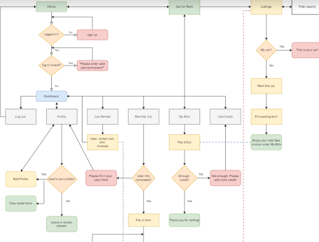
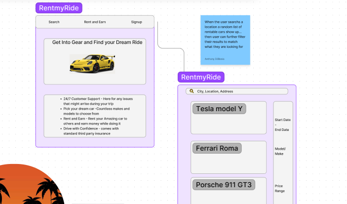
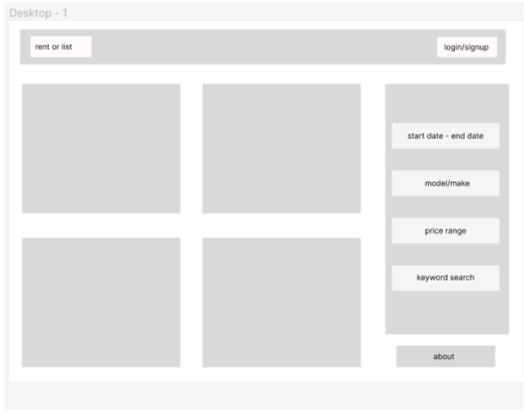

# RentMyRide

## Description

This is a car rental app for users to peruse cars, prices, and availability based on their rental needs. It will require an account for all users. When they log in, they can search and browse images, descriptions, availability, and prices for rentals before booking and completing a transaction. Users can view/modify/cancel their bookings.

## Table of Contents

- [Description](#description)
- [Installation](#installation)
- [Technology](#technology)
- [Usage](#usage)
- [License](#license)
- [Contributing](#contributing)
- [Tests](#tests)
- [Questions](#questions)
- [DeployedLink](#deployedlink)

## Installation
- run the command npm run develop in your terminal to run this locally

## Technology
- root (RentMyRide)
  - scripts: 
    - start: "node server/server.js --ignore client"
    - develop: "concurrently \"cd server && npm run watch\" \"cd client && npm start\""
    - install: "cd server && npm i && cd ../client && npm i"
    - seed: "cd server && npm run seed"
    - build: "cd client && npm run build"
  
  
  - devDependencies: 
    - concurrently": 5.3.0
  
  - dependencies: 
    - @fortawesome/free-brands-svg-icons: 6.1.2
    - @fortawesome/fontawesome-svg-core: 6.1.2
    - @fortawesome/react-fontawesome: 0.2.0
    - bcrypt": "^5.0.1"
 
- server 
  - dependencies
    - apollo-server-express: 3.6.2
    - bcrypt: 5.0.1
    - db: 3.3.1
    - dotenv: 16.0.1
    - express: 4.17.2
    - graphql: 16.3.0
    - jsonwebtoken: 8.5.1
    - mongodb: 4.8.1
    - mongoose: 6.1.8
 
  - devDependencies
    - nodemon: 2.0.6
- client
  - dependencies:
    - @apollo/client": "^3.6.9",
    - @fortawesome/fontawesome-svg-core": "^6.1.2",
    - @fortawesome/free-solid-svg-icons": "^6.1.2",
    - @fortawesome/react-fontawesome": "^0.2.0",
    - @testing-library/jest-dom": "^5.16.5",
    - @testing-library/react": "^13.3.0",
    - @testing-library/user-event": "^14.4.3",
    - bootstrap": "^5.2.0",
    - graphql": "^16.6.0",
    - jwt-decode": "^3.1.2",
    - mdb-react-ui-kit": "^4.1.0",
    - moment": "^2.29.4",
    - react": "^18.2.0",
    - react-bootstrap": "^2.5.0",
    - react-datepicker": "^4.8.0",
    - react-dom": "^18.2.0",
    - react-router-dom": "^6.3.0",
    - react-scripts: 5.0.1
  
## Usage

To provide a platform for users to choose from a selection of rental cars and for car owners to post their vehicles to rent out.

## Wireframes and Chart
[Link to proposal](https://docs.google.com/document/d/1D5Cq0w9Jo1kW4Pujggm2wF3VBmuCN4jDpSmqHO180ao/edit?usp=sharing)

[Link to the flowchart](https://drive.google.com/file/d/1MycvUaWPEpJJteG47msUcZ8yU9hzpzVp/view?usp=sharing)  

[Wireframes link](https://www.figma.com/file/8xRfNioMSx6lp4lSpvg7em/Diagram---Untitled?node-id=0%3A1)  

## License
This application is covered by the MIT License, the terms of which can be found [here](https://opensource.org/licenses/MIT)

## Contributing

- [`Jen Cho`](https://github.com/choyoonme)
- [`Anthony DiBlasio`](https://github.com/AnthonyDiBlasio)
- [`Cal Paschall`](https://github.com/cpaschall)
- [`Vincent Tjia`](https://github.com/binnie51)
- [`Sajjad Zaidi`](https://github.com/sajjazaidi2015)

## Tests

## Questions

- [`Anthony DiBlasio`](https://github.com/anthonydiblasio/) 
- [`Jen Cho`](https://github.com/choyoonme)
- [`Cal Paschall`](https://github.com/cpaschall)
- [`Vincent Tjia`](https://github.com/binnie51)
- [`Sajjad Zaidi`](https://github.com/sajjazaidi2015)

## DeployedLink

[RentMyRide](https://rentmyride01.herokuapp.com/)
